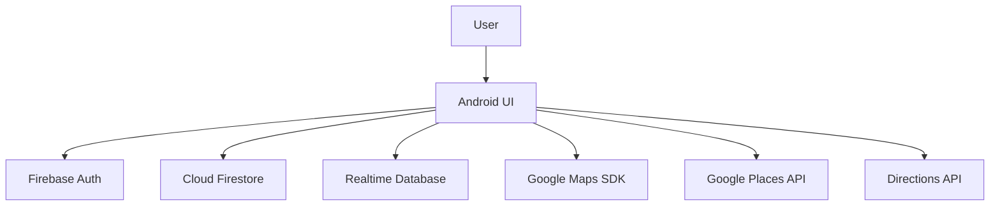
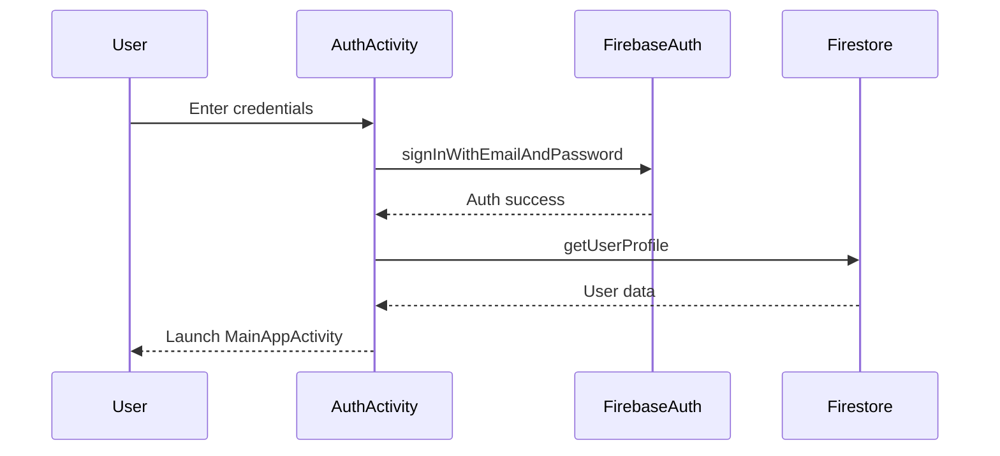

# TradGet

## Project Overview
TradGet is an Android ridesharing application focused on short, local trips where riders and passengers split fuel costs. It provides a full client-side experience with location search, ride publishing, ride discovery, in-app chat, and route visualization. The app targets students and commuters who want a simple, transparent way to share rides and reduce travel expenses.

From a technical perspective, TradGet is a native Android app written in Java and powered by Firebase (Authentication, Cloud Firestore, and Realtime Database). It integrates Google Maps, Places, and Directions APIs to handle location search, routing, and map visualization. The solution is entirely client-driven, meaning there is no custom backend in this repository; data persistence and real-time updates are handled through Firebase services.

For non-technical stakeholders, TradGet offers a practical way to coordinate rides, keep costs visible, and maintain communication in one place. For technical reviewers, it demonstrates integration of multiple Google APIs, real-time messaging, multi-step business workflows, and in-app caching.

## Problem Statement
Ridesharing for short-distance, local trips often suffers from unreliable coordination, unclear costs, and limited trust between strangers. Existing solutions typically focus on long-distance or commercial rides and do not prioritize small-scale, cost-sharing scenarios common in campuses and dense residential areas.

Pain points addressed:
- Riders and passengers lack a clear way to calculate and split fuel costs.
- Manual coordination happens across multiple apps (maps, chat, payments).
- Users cannot easily see current ride availability in their immediate area.
- There is little transparency around ride status and acceptance flow.

TradGet addresses these with a unified flow: location selection, ride publishing/search, request management, real-time chat, and map-based routing, all in a single mobile experience.

## Project Objectives
Primary objectives:
- Enable riders to publish rides with route and pricing details.
- Enable passengers to discover, request, and join rides.
- Support real-time communication between ride participants.

Secondary objectives:
- Provide cost-per-person fuel split calculations.
- Maintain a simple ride history and status tracking system.
- Support user profiles with ratings and stats.

Performance objectives:
- Reduce redundant Firestore reads via in-app caching.
- Minimize UI latency in list rendering.

User experience objectives:
- Provide clear ride states (pending, accepted, completed, cancelled).
- Offer smooth navigation and consistent UI feedback.

Scalability objectives:
- Use Firebase managed services for data storage and realtime updates.
- Keep client logic modular for future enhancements.

Security objectives:
- Authenticate users via Firebase Authentication.
- Restrict sensitive data access through Firebase rules (not in repo).

## Key Features

### Authentication (Email/Password + Google Sign-In)
- Purpose: Secure user onboarding and login.
- How it works: Firebase Auth manages email/password and Google Sign-In.
- User benefits: Fast signup and consistent login experience.
- Technical implementation: FirebaseAuth + GoogleSignInClient.
- Dependencies: Firebase Auth, Google Play Services Auth.
- Core files: app/src/main/java/com/example/tradget/AuthActivity.java

### Ride Discovery (Passenger Mode)
- Purpose: Let passengers search for rides by pickup and destination.
- How it works: Firestore query filters by fromName, toName, status.
- User benefits: Clear, filtered list of available rides.
- Implementation: FirestoreRepository.searchRides, HomeFragment UI cards.
- Dependencies: Firestore, Places API, Location Services.
- Core files: app/src/main/java/com/example/tradget/HomeFragment.java, app/src/main/java/com/example/tradget/FirestoreRepository.java

### Ride Publishing (Rider Mode)
- Purpose: Allow riders to post new rides with route details.
- How it works: Ride details stored as Firestore documents.
- User benefits: Publish a ride with seat availability and cost estimates.
- Implementation: PublishRideActivity publishes Ride to Firestore.
- Dependencies: Firestore, Maps Directions API (distance).
- Core files: app/src/main/java/com/example/tradget/PublishRideActivity.java

### Ride Requests and Acceptance Flow
- Purpose: Manage passenger requests and rider responses.
- How it works: RideRequest documents track status lifecycle.
- User benefits: Clear acceptance and rejection flow.
- Implementation: FirestoreRepository.createRideRequest, updateRequestStatus, listenToRideRequest.
- Dependencies: Firestore.
- Core files: app/src/main/java/com/example/tradget/RideDetailActivity.java, app/src/main/java/com/example/tradget/FirestoreRepository.java

### Real-Time Chat
- Purpose: Enable in-app communication after ride acceptance.
- How it works: Realtime Database messages stored by chatId.
- User benefits: Direct coordination without leaving the app.
- Implementation: RealtimeChatRepository with ChildEventListener.
- Dependencies: Firebase Realtime Database.
- Core files: app/src/main/java/com/example/tradget/ChatFragment.java, app/src/main/java/com/example/tradget/RealtimeChatRepository.java

### Map Route Visualization
- Purpose: Show the driving route between pickup and destination.
- How it works: Directions API + polyline decoding.
- User benefits: Visual clarity of the ride path.
- Implementation: MapActivity uses DirectionsHelper + PolylineDecoder.
- Dependencies: Maps SDK, Directions API, OkHttp.
- Core files: app/src/main/java/com/example/tradget/MapActivity.java, app/src/main/java/com/example/tradget/DirectionsHelper.java, app/src/main/java/com/example/tradget/PolylineDecoder.java

### Cost Splitting
- Purpose: Show cost per person based on distance and fuel price.
- How it works: Fuel cost formulas in CostCalculator.
- User benefits: Transparent ride pricing.
- Implementation: CostCalculator + UI bindings in MapActivity and PublishRideActivity.
- Dependencies: None (pure Java).
- Core files: app/src/main/java/com/example/tradget/util/CostCalculator.java

### Caching Layer
- Purpose: Reduce repeated Firestore calls for common data.
- How it works: In-memory + SharedPreferences cache with TTL.
- User benefits: Faster search and profile load.
- Implementation: CacheManager used in HomeFragment and ProfileFragment.
- Dependencies: Gson.
- Core files: app/src/main/java/com/example/tradget/CacheManager.java

### Favorites
- Purpose: Allow passengers to save favorite riders.
- How it works: Firestore subcollection users/{uid}/favorites.
- User benefits: Quick access to preferred riders.
- Implementation: addFavorite/removeFavorite/isFavorite in FirestoreRepository.
- Dependencies: Firestore.
- Core files: app/src/main/java/com/example/tradget/FirestoreRepository.java, app/src/main/java/com/example/tradget/HomeFragment.java

## System Architecture

### High-Level Architecture
- Frontend: Native Android app (Java, AndroidX, Material components)
- Backend: Firebase managed services (Firestore, Realtime Database, Auth)
- Database: Firestore (structured documents) + Realtime Database (chat)
- External Services: Google Maps Platform (Maps, Places, Directions)

Data Flow (simplified):



## Detailed Technology Stack

### Java 11
Purpose: Primary application language.
Role: Implements app logic, UI controllers, and data models.
Advantages: Strong Android ecosystem support, stable runtime.
Alternatives: Kotlin.
Current Usage: All source files in app/src/main/java.

### Android SDK (Compile SDK 36)
Purpose: Build and run the Android app.
Role: Provides platform APIs, resources, and build tools.
Advantages: Access to modern Android features.
Alternatives: Older SDK versions.
Current Usage: app/build.gradle.kts.

### Gradle (Kotlin DSL)
Purpose: Build automation and dependency management.
Role: Defines build configuration and dependencies.
Advantages: Flexible, standard for Android.
Alternatives: Maven.
Current Usage: build.gradle.kts, app/build.gradle.kts.

### AndroidX Libraries
Purpose: Core Android UI and app infrastructure.
Role: AppCompat, Activity, ConstraintLayout.
Advantages: Backward compatibility, maintained by Google.
Alternatives: Legacy support libraries.
Current Usage: app/build.gradle.kts, UI layouts.

### Material Components
Purpose: Modern UI components and theming.
Role: Buttons, cards, and UI styles.
Advantages: Consistent design system.
Alternatives: Custom UI.
Current Usage: app/build.gradle.kts, layout XML.

### Firebase Authentication
Purpose: User authentication.
Role: Handles login and user identity.
Advantages: Secure, managed auth service.
Alternatives: Custom backend auth.
Current Usage: app/src/main/java/com/example/tradget/AuthActivity.java.

### Cloud Firestore
Purpose: Primary data store for rides, users, requests.
Role: CRUD operations and query filtering.
Advantages: Real-time updates, scalable.
Alternatives: Custom REST API + SQL/NoSQL.
Current Usage: app/src/main/java/com/example/tradget/FirestoreRepository.java.

### Firebase Realtime Database
Purpose: Real-time chat messaging.
Role: Message storage and streaming updates.
Advantages: Low-latency updates.
Alternatives: Firestore real-time chat collections.
Current Usage: app/src/main/java/com/example/tradget/RealtimeChatRepository.java.

### Google Maps SDK
Purpose: Map rendering and markers.
Role: Display route map.
Advantages: Reliable map visualization.
Alternatives: Mapbox.
Current Usage: app/src/main/java/com/example/tradget/MapActivity.java.

### Google Places API
Purpose: Location search and autocomplete.
Role: Search and select pickup/destination.
Advantages: Accurate, fast location predictions.
Alternatives: Mapbox Places.
Current Usage: app/src/main/java/com/example/tradget/HomeFragment.java.

### Google Directions API
Purpose: Route calculation and ETA.
Role: Provides polyline and distance info.
Advantages: Accurate driving routes.
Alternatives: OpenRouteService.
Current Usage: app/src/main/java/com/example/tradget/DirectionsHelper.java, app/src/main/java/com/example/tradget/util/DistanceCalculator.java.

### OkHttp
Purpose: HTTP client for Directions API requests.
Role: Fetch route JSON.
Advantages: Efficient networking, simple API.
Alternatives: Retrofit.
Current Usage: app/src/main/java/com/example/tradget/DirectionsHelper.java.

### Volley
Purpose: HTTP requests in DistanceCalculator.
Role: Fetch distance/duration for publish flow.
Advantages: Built-in request queue.
Alternatives: OkHttp/Retrofit.
Current Usage: app/src/main/java/com/example/tradget/util/DistanceCalculator.java.

### Gson
Purpose: JSON serialization for cache layer.
Role: Serialize/deserialize cached objects.
Advantages: Simple, lightweight.
Alternatives: Moshi.
Current Usage: app/src/main/java/com/example/tradget/CacheManager.java.

### JUnit + Espresso
Purpose: Basic unit/instrumentation testing.
Role: Sample tests.
Advantages: Standard Android testing stack.
Alternatives: Kotest.
Current Usage: app/src/test/java/com/example/tradget/ExampleUnitTest.java, app/src/androidTest/java/com/example/tradget/ExampleInstrumentedTest.java.

## Complete Project Structure

```
.
├── app/
│   ├── src/
│   │   ├── main/
│   │   │   ├── AndroidManifest.xml
│   │   │   ├── java/com/example/tradget/
│   │   │   │   ├── activities, fragments, repositories, helpers
│   │   │   │   ├── model/
│   │   │   │   └── util/
│   │   │   └── res/
│   │   │       ├── anim/
│   │   │       ├── color/
│   │   │       ├── drawable/
│   │   │       ├── layout/
│   │   │       ├── menu/
│   │   │       ├── values/
│   │   │       └── xml/
│   │   ├── test/
│   │   └── androidTest/
├── build.gradle.kts
├── settings.gradle.kts
├── gradle/libs.versions.toml
├── google-services.json
└── local.properties
```

### app/src/main/java/com/example/tradget/
Purpose: Core application logic and UI controllers.
Responsibilities: Activities, Fragments, repositories, utilities, models.
Important files:
- app/src/main/java/com/example/tradget/MainAppActivity.java: Bottom navigation host.
- app/src/main/java/com/example/tradget/HomeFragment.java: Search/publish workflow.
- app/src/main/java/com/example/tradget/FirestoreRepository.java: Firestore data access.
- app/src/main/java/com/example/tradget/RealtimeChatRepository.java: Realtime chat operations.

### app/src/main/java/com/example/tradget/model/
Purpose: Data models for Firestore and Realtime DB.
Responsibilities: User, Ride, RideRequest, ChatMessage.
Important files:
- app/src/main/java/com/example/tradget/model/User.java
- app/src/main/java/com/example/tradget/model/Ride.java
- app/src/main/java/com/example/tradget/model/RideRequest.java
- app/src/main/java/com/example/tradget/model/ChatMessage.java

### app/src/main/java/com/example/tradget/util/
Purpose: Utility functions for distance and cost.
Responsibilities: Distance calculation, cost calculation.
Important files:
- app/src/main/java/com/example/tradget/util/DistanceCalculator.java
- app/src/main/java/com/example/tradget/util/CostCalculator.java

### app/src/main/res/layout/
Purpose: XML layout resources for activities and fragments.
Important files:
- activity_auth.xml
- activity_main_app.xml
- activity_map.xml
- fragment_home.xml
- fragment_chat.xml
- fragment_profile.xml

## Database Design

### Cloud Firestore
Collections:

1) users
- Purpose: Store user profiles and stats.
- Fields: name, email, phone, rating, totalRatings, ridesCompleted, totalSaved, createdAt.
- Subcollections: favorites (riderId, addedAt).
- Used by: AuthActivity, ProfileFragment, FirestoreRepository.

2) rides
- Purpose: Store ride offers.
- Fields: riderId, riderName, riderRating, vehicleType, fromName, toName, coords, departureTime, seatsAvailable, fuelPrice, distanceKm, costPerPerson, status, createdAt.
- Used by: PublishRideActivity, HomeFragment, HistoryFragment.

3) rideRequests
- Purpose: Store ride join requests and status.
- Fields: rideId, passengerId, riderId, status, pickupName, dropName, costAgreed, requestedAt.
- Used by: RideDetailActivity, HomeFragment, ChatFragment.

Indexes and constraints:
- Query patterns include filters on fromName, toName, status, and passengerId/riderId.

### Realtime Database
- Path: chats/{chatId}/messages/{messageId}
- Purpose: Store real-time chat messages.
- Used by: ChatFragment, RealtimeChatRepository.

## API Documentation
This project does not expose a custom HTTP API. All data access is performed directly from the Android client using Firebase and Google APIs.

### Firestore Operations (Client Data Layer)
These are not HTTP endpoints, but represent the application API surface from the client perspective:
- createUser: Create/overwrite user document.
- getUserProfile: Fetch user profile.
- publishRide: Add a ride document.
- searchRides: Query rides by route and status.
- createRideRequest: Add ride request.
- updateRequestStatus: Accept/reject/cancel/complete request.
- listenToRideRequest: Real-time updates for request status.
- getAcceptedRequestsForUser: Populate chat list.
- addFavorite/removeFavorite/isFavorite: Manage favorites.

### External HTTP APIs
- Directions API (route and ETA): DirectionsHelper
- Directions API (distance/duration): DistanceCalculator

## External APIs and Services

### Firebase Authentication
Purpose: User identity and login.
Configuration: google-services.json, default_web_client_id.
Importance: Critical.

### Cloud Firestore
Purpose: Primary persistent data store.
Configuration: google-services.json.
Importance: Critical.

### Firebase Realtime Database
Purpose: Real-time chat.
Configuration: google-services.json.
Importance: High.

### Google Maps SDK
Purpose: Map rendering.
Configuration: MAPS_API_KEY in local.properties.
Importance: High.

### Google Places API
Purpose: Location search.
Configuration: MAPS_API_KEY in local.properties.
Importance: High.

### Google Directions API
Purpose: Route polyline and ETA.
Configuration: MAPS_API_KEY in local.properties.
Importance: High.

## Authentication and Authorization

### Login Flow (Email)
1. User enters email/password in AuthActivity.
2. FirebaseAuth.signInWithEmailAndPassword.
3. On success, user profile is loaded from Firestore.

### Signup Flow
1. User enters name/email/password.
2. FirebaseAuth.createUserWithEmailAndPassword.
3. User profile document created in Firestore.

### Google Sign-In Flow
1. GoogleSignInClient launches sign-in intent.
2. FirebaseAuth.signInWithCredential.
3. New users get Firestore profile created.

Sequence (simplified):



## Security Measures
- Authentication: Firebase Authentication (email/password + Google Sign-In).
- Authorization: Enforced by Firebase security rules (not in repo).
- Secrets management: MAPS_API_KEY stored in local.properties and injected at build time.
- Input validation: Basic checks in AuthActivity and ErrorHandler.

Not implemented in repo:
- Server-side validation
- Rate limiting
- CSRF/XSS (not relevant to native app)

## Environment Variables

| Variable | Purpose | Required | Example |
|---------|---------|----------|---------|
| MAPS_API_KEY | Google Maps/Places/Directions key injected into BuildConfig and manifest | Yes | AIza... |
| default_web_client_id (strings.xml) | Google Sign-In OAuth client ID | Yes | 9185...apps.googleusercontent.com |

## Installation Guide

Prerequisites:
- Android Studio
- JDK 11
- Android SDK 36
- Firebase project with google-services.json
- Google Maps API key

Steps:
1. Clone repository.
2. Open in Android Studio.
3. Add google-services.json to project root.
4. Create local.properties with MAPS_API_KEY.
5. Sync Gradle.
6. Build and run on emulator/device.

## Deployment Architecture
- Build system: Gradle (Kotlin DSL).
- Artifact: Android APK.
- CI/CD: Not configured in repository.
- Hosting: Mobile distribution not defined in repo.

## Current Development Progress

### Completed Features
- Authentication (email/password, Google Sign-In) - fully implemented.
- Ride publishing and search - implemented with Firestore queries.
- Ride request lifecycle (pending, accepted, rejected, cancelled, completed) - implemented.
- Real-time chat - implemented with Realtime Database.
- Map routing and polyline visualization - implemented.
- Profile display with cached data - implemented.
- Favorites feature - implemented (riders can be favorited).

### Partially Completed Features
- Pagination: PaginationHelper exists but not integrated into history lists.
- Error handling: Centralized ErrorHandler exists; some screens still use Toasts.

### Planned Features
- Wallet/payment integration (menu placeholder).
- Push notifications.
- Additional settings and emergency contacts.

## Progress Summary For Non-Technical Stakeholders
The core ridesharing system is functional. Users can create accounts, search for rides, publish rides, request seats, and chat with other riders in real time. The app also calculates ride costs and displays routes on a map. Some advanced features like payments and notifications are not yet built, but the foundational workflow is complete.

## Development Timeline

| Module | Status | Completion % |
|--------|--------|--------------|
| Authentication | Complete | 100% |
| Ride Search | Complete | 100% |
| Ride Publishing | Complete | 100% |
| Ride Requests | Complete | 100% |
| Chat | Complete | 100% |
| Maps + Routing | Complete | 90% (blocked by API key config) |
| Favorites | Complete | 100% |
| Profile | Complete | 100% |
| Caching | Complete | 100% |
| Pagination | Partial | 40% |
| Payments | Planned | 0% |
| Notifications | Planned | 0% |

## Known Issues
- Directions API key configuration can cause REQUEST_DENIED errors if not correctly enabled or billed.
- Pagination helper is not yet integrated in HistoryFragment.

## Future Enhancements

High Priority:
- Integrate pagination in history lists.
- Add robust error recovery for network failures.

Medium Priority:
- Wallet/payment module.
- Push notifications for request updates.

Low Priority:
- UI refinements and additional settings options.

## Testing Strategy
- Unit tests: ExampleUnitTest (placeholder only).
- Instrumentation tests: ExampleInstrumentedTest (placeholder only).
- Manual testing: Primary verification method.

## Performance Considerations
- CacheManager reduces repeated Firestore reads.
- Ride search limited to 50 results.
- Uses lightweight UI components (TextView, LinearLayout) for dynamic cards.

## Scalability Considerations
- Firebase Firestore scales with user count; client queries should be indexed for production.
- Realtime Database supports chat scaling by chatId partitioning.

## Conclusion
TradGet is a full-featured Android ridesharing application focused on local, cost-sharing trips. It integrates Firebase services for authentication, data persistence, and real-time chat, and uses Google Maps APIs for route and location intelligence. The core workflow is complete and functional, with opportunities to expand into payments, notifications, and further UI enhancements.
